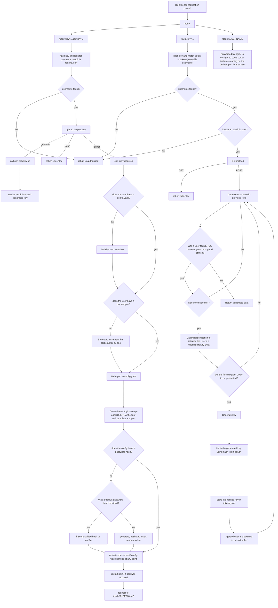

# setup-app
A tool for managing a shared device to allow multiple people to code it on the same time.
This has been designed for Ubuntu but can also be used on a [Raspberry Pi](https://www.raspberrypi.org/) in schools for example.

This includes functionality to allow users to have their own VS [code-server](https://github.com/coder/code-server) instances and automatically setups [MySQL](https://www.mysql.com/) accounts.

You could also consider having [MySQL installed](https://ubuntu.com/server/docs/databases-mysql).

If you're using this app with any significant number of users, you'll likely want to set up daily restarts and updates using cron (or equivalent) to shutdown any vscode instances from that day

You'll also need systemctl available on your system. If you're using wsl, you may need to insert the following into `/etc/wsl.conf`
```conf
[boot]
systemd=true
```

This app also assumes you have nothing running on TCP ports `8999`+, if you do, as soon as you clone this repo edit `.env` and change the `START_PORT` value to a larger value. The maximum port the app will use depends on the maximum number of user's you're expecting. It should be exactly `START_PORT + MAX_USERS` but could go up if any user deletes the cached port (`~/.setupappport`) in their home directory. 

If you need to change the bind port (default `8999`), you'll need to update the port in both `.env` and the nginx snippet below.

## Installation
1. Download and install [code-server](https://github.com/coder/code-server/releases/latest) if not already installed, e.g:
```bash
wget https://github.com/coder/code-server/releases/download/v4.23.1/code-server_4.23.1_amd64.deb
sudo apt install -y ./code-server_4.23.1_amd64.deb
rm code-server_4.23.1_amd64.deb # optional
```
2. Clone this repo, install the requirements, run the setup script and move it into `/srv`:
```bash
git clone git@github.com:maartin0/setup-app
cd setup-app
sudo python3 -m pip install -r requirements.txt
python3 app.py setup # When prompted, enter a user to generate a login URL for
cd ..
sudo mv setup-app /srv
```
3. Save the URL generated in step 2 (in a text editor somewhere or as a bookmark). Note that the hostname is likely to be incorrect, if so, edit `.env` and update the `HOSTNAME=` entry so that future links are generated correctly.
4. Check permissions are correct (you can adjust these but make sure that *all* users can execute the scripts in `scripts/`):
```bash
chmod -R 755 /srv/setup-app
```
5. Install [argon2-cli](https://www.npmjs.com/package/argon2-cli). Since `code-server` uses this for password hashes, it's also required by this script. You can run the following which will automatically install the latest version of node if `npm` isn't available and then prompt you to type in `y` if `argon2-cli` isn't already installed. If this is successful, you should see an arbitrary hash generated. Run this as root since the app runs as root and the installation is user-specific.
```bash
sudo ./scripts/util/hash-with-argon2.sh
```
6. Install and enable nginx if you haven't already
```bash
sudo apt install -y nginx
sudo systemctl enable nginx
```
7. Configure nginx. Go to /etc/nginx/sites-available and edit `default`:
```bash
cd /etc/nginx/sites-available
sudo nano default
```
* Find the `server` entry and verify the port is what you want it to be (probably `80`). 
* If this is a fresh install of nginx, comment out everything in the `server` block except the two `listen` declarations and `server_name`
* Then add the following to the end of the `server` block:
```
location /user {
    proxy_pass http://127.0.0.1:8999/user;
}
location /bulk {
    proxy_pass http://127.0.0.1:8999/bulk;
}

include /etc/nginx/setup-app/*.conf;
```
The `default` file now should look something like the following:
```
server {
    listen 80 default_server;
    listen [::]:80 default_server;
    
    server_name _;

    location /user {
        proxy_pass http://127.0.0.1:8999/user;
    }
    location /bulk {
        proxy_pass http://127.0.0.1:8999/bulk;
    }

    include /etc/nginx/setup-app/*.conf;
}
```
9. Restart nginx
```bash
sudo systemctl restart nginx
```
10. Setup the systemctl service
```bash
sudo cp patches/setup-app.service /etc/systemd/system/
sudo systemctl daemon-reload
sudo systemctl enable setup-app
sudo systemctl start setup-app
```
12. Navigate to the link generated in step 2. Check "launch vs-code" works and then click on "Administrator tools" if you want to generate more login URLs. 
* If you get an error saying "Could not find stored hash", make sure you haven't got any old code-server config files in `$HOME/.config/code-server/config.yaml`. If so, delete this and try again

## Files

* /srv/setup-app/lastport.txt
* /srv/setup-app/tokens.json
* /etc/systemd/system/setup-app.service
* /etc/nginx/setup-app/*.conf
* $HOME/.setupappport
* $HOME/.config/code-server/config.yaml

## Screenshots
Screenshot of the user control panel (at `/user`):


Screenshot of the bulk account creation tool (at `/bulk`):


## How authentication works
There's two separate authentication methods here. The app's own control panel itself and `code-server`'s authentication.
The app works by generating a random base64 key which is then included in all the URLs and the sha256 hash of that key is then stored in `tokens.json` where it can be validated on each request.

`code-server` supports several authentication methods via it's configuration file at `$HOME/.config/code-server/config.yaml`. 

The default method uses a `password` entry which just compares the plain text provided on login. The hash of that password is stored as a cookie on the client and compared to the plaintext password on disk.

The method used by this app is via the `hashed-password` property which has a bit of an odd implementation, but involves storing a password hash on disk and on login if the provided password matches the hash on disk, then the hash on disk is sent to the client as a cookie and when checking the session the app just checks the cookie value is identical to the value stored in the `hashed-password` property. This method doesn't add any security but just obfuscates it. There's a comment about this in the source code.

## Security considerations
This has been designed for use on a sandboxed virtual machine on a closed local network. Expose to the internet at your own risk.

## Request flowchart
Although this isn't the easiest to read, it may help if you're trying to understand the flows behind how this works

